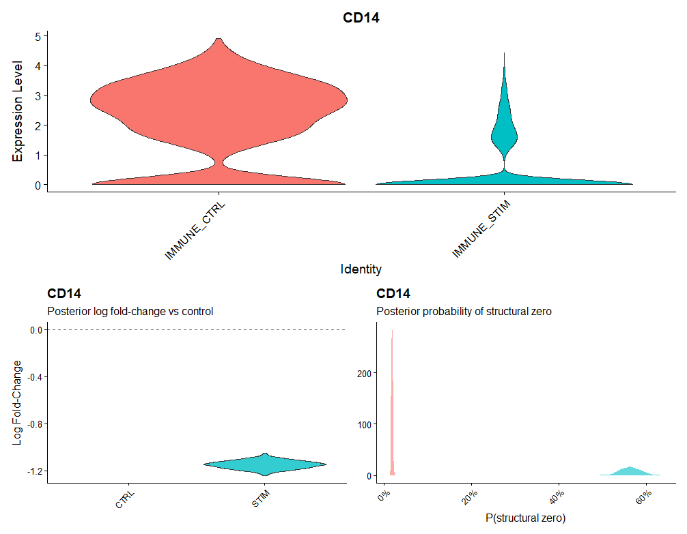

# SeuratBayesian

Bayesian differential expression for single-cell RNA-sequencing data via zero-inflated negative binomial (ZINB) models.

The package wraps Bayesian ZINB modelling for scRNA-seq data stored as Seurat objects using `brms`. It is intended as an alternative to Seurat's default (non-genome wide) differential expression screening (Wilcoxon rank-sum, DESeq2 or edgeR wrappers).

## Why?
Other than a interesting application of Bayesian modelling in the biological field, scRNA-seq count data has two sources of 0 reads:

- **Biological Zeros**: The gene is genuinely not expressed.
- **Technical Dropouts**: Gene expression not captured.

Where a candidate gene is difficult to characterise across highly similar, small groups, this tool provides a full posterior distribution around the gene's fold change for a more rigorous evaluation of expression differences.

## Installation

SeuratBayesian requires a working Stan installation. You **must** install `cmdstanr` before executing the workflow. This allows models to compile to C++ on the first run and reduce subsequent computational load.

```r
# install Stan
install.packages("cmdstanr", repos = c("https://mc-stan.org/r-packages/", getOption("repos")))
cmdstanr::install_cmdstan()

# install SeuratBayesian
devtools::install_github("aes21/SeuratBayesian")
```

## Quick Start
The following example uses the `ifnb` dataset from the SeuratData package. Using a subset of CD14+ monocytes, we display how applying SeuratBayesian highlights key expression differences in CD14. 

```r
library(Seurat)
library(SeuratBayesian)
library(SeuratData)

InstallData("ifnb")
```

### Fit the model to a gene
To enable an "open-ended" analysis of log fold-change posterior distribution calculated by the fit model for the provided gene, the `sc_fit_bayesian()` function (see below for visualisation function wrapping) returns the standard `brms` fit object.

```r
# load the Seurat object
data("ifnb")

# subset for specific cell group
mono <- subset(ifnb, subset = seurat_annotations == "CD14 Mono")

# fit model
fit <- sc_fit_bayesian(
  object = mono,
  feature = "CD14",
  group.by = "stim",
  ctr.ident = "CTRL"
)

# downstream brms tools to evaluate fit
posterior_summary(fit)
```
```
                   Estimate  Est.Error        Q2.5      Q97.5
b_Intercept      -6.4641956 0.04050887  -6.5386461 -6.3821472
b_zi_Intercept   -4.2316024 0.65323779  -5.4748927 -2.9132264
b_conditionSTIM  -1.9981520 0.06535874  -2.1255479 -1.8734239
shape             0.7940529 0.03202204   0.7357693  0.8598465
Intercept        -7.4476968 0.02589520  -7.4989307 -7.3960797
Intercept_zi     -4.2316024 0.65323779  -5.4748927 -2.9132264
lprior          -11.0757485 1.22774904 -13.7458231 -8.8887714
lp_approx__      -1.9977503 1.40918513  -5.5777273 -0.2784322
```

### Visualising posterior distributions
The whole workflow (model fit to posterior distribution of log fold-change) can be completed using the `VlnPlot_Bayesian()` wrapper function.

```r
VlnPlot_Bayesian(mono, feature = gene_of_interest, group.by = "stim", ctr.ident = "CTRL")
```



The violin plot shows the posterior distribution of log fold-change for each group against the defined control. The control group is shown with a log fold-change fixed at 0 (as the reference level). Please see the model vignette for justification of the model formula and prior construction.
